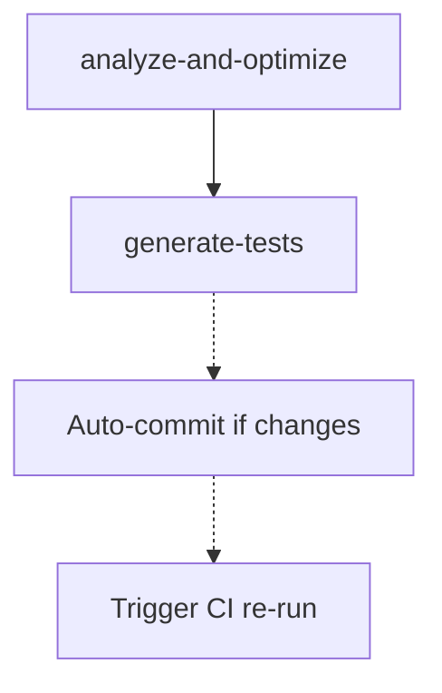

# Self-Optimizing Workflow Integration Guide

## Overview

This document explains how the Self-Optimizing Workflow integrates with the existing CI/CD pipeline and how to use it effectively.

## Architecture

### Workflow Integration

```
┌─────────────────────────────────────────────────────────────┐
│                        Pull Request Created                  │
└─────────────────────┬───────────────────────────────────────┘
                      │
                      ├──────────────────────┬─────────────────┐
                      ▼                      ▼                 ▼
          ┌───────────────────┐  ┌──────────────────┐ ┌──────────────┐
          │   CI Workflow     │  │  Self-Optimize   │ │   CodeQL     │
          │   (ci.yml)        │  │  (self-optimize) │ │              │
          └─────────┬─────────┘  └────────┬─────────┘ └──────┬───────┘
                    │                     │                   │
                    │  ┌──────────────────┘                   │
                    │  │                                      │
                    ▼  ▼                                      ▼
          ┌────────────────────┐               ┌─────────────────────┐
          │  Tests Pass        │               │  Security Pass      │
          │  Build Success     │               │  No Critical Issues │
          └─────────┬──────────┘               └──────────┬──────────┘
                    │                                     │
                    └──────────────┬──────────────────────┘
                                   ▼
                         ┌──────────────────┐
                         │  Auto-Fix Commit │
                         │  (if changes)    │
                         └─────────┬────────┘
                                   │
                                   ▼
                         ┌──────────────────┐
                         │  CI Re-runs      │
                         └─────────┬────────┘
                                   │
                                   ▼
                         ┌──────────────────┐
                         │  All Pass?       │
                         └─────────┬────────┘
                                   │
                            ┌──────┴──────┐
                            ▼             ▼
                     ┌──────────┐   ┌──────────┐
                     │Auto-Merge│   │  Manual  │
                     │(if label)│   │  Merge   │
                     └──────────┘   └──────────┘
```

## Workflow Stages in Detail

### 1. Trigger Conditions

The workflow triggers on:

```yaml
on:
  pull_request:
    branches: [dev, develop, main]
    types: [opened, synchronize, reopened]
  workflow_dispatch:
```

**Rationale:**
- `dev` branch: Primary development branch (most active)
- `develop` branch: Integration branch
- `main` branch: Production (read-only, no auto-commit)

### 2. Job Dependencies



The workflow has two main jobs:
1. **analyze-and-optimize**: Main analysis and optimization
2. **generate-tests**: Generates test stubs (depends on analysis)

### 3. Parallel Execution

The workflow runs in parallel with the CI workflow:

```yaml
# CI Workflow (ci.yml)
jobs:
  install: ~10 min
  lint: ~5 min
  typecheck: ~5 min
  tests: ~10 min
  build: ~10 min
  Total: ~30 min

# Self-Optimize Workflow
jobs:
  analyze-and-optimize: ~20 min
  generate-tests: ~10 min
  Total: ~30 min
```

**Total Time**: ~30 minutes (parallel execution)

## Integration Points

### With CI Workflow (`ci.yml`)

**Shared:**
- Node.js setup
- Dependency installation
- ESLint configuration
- Test infrastructure

**Differences:**
- CI: Validates code as-is
- Self-Optimize: Modifies code to fix issues

**Coordination:**
1. Both run on PR open/update
2. Self-Optimize may commit fixes
3. CI re-runs on new commit
4. Both must pass for merge

### With Auto-Merge Workflow (`auto-merge.yml`)

**Integration:**
```yaml
# auto-merge.yml checks:
- All CI checks pass ✓
- Self-optimize checks pass ✓
- At least 1 approval (for non-Dependabot)
- No changes requested
- Not in draft state
```

**Flow:**
1. PR opened
2. CI + Self-Optimize run
3. Self-Optimize commits fixes (if any)
4. CI re-runs on new commit
5. All checks pass
6. Auto-merge triggers (if labeled)

### With CodeQL Workflow (`codeql-analysis.yml`)

**Integration:**
- Self-Optimize includes CodeQL analysis
- Results uploaded to Security tab
- Critical issues block merge (optional)

**Coordination:**
```yaml
# In self-optimize.yml
- name: Run CodeQL analysis
  uses: github/codeql-action/analyze@v3
  
# Results available in:
# 1. Security tab (via CodeQL)
# 2. PR comments (via Self-Optimize)
```

## Data Flow

### Input Data

```
Pull Request
  ├── Changed files
  ├── PR metadata (number, branch, author)
  └── Git history
        │
        ▼
  ┌─────────────────┐
  │  Self-Optimize  │
  └────────┬────────┘
           │
           ├── Reads: .github/self-optimize-config.yml
           ├── Reads: .eslintrc.json
           ├── Reads: tsconfig.json
           └── Reads: jest.config.js
```

### Output Data

```
Self-Optimize Workflow
        │
        ├── Artifacts (30 day retention)
        │   ├── optimization-report.md
        │   ├── eslint-report.json
        │   ├── ts-prune-report.json
        │   ├── depcheck-report.json
        │   ├── npm-audit.json
        │   ├── coverage-report.md
        │   └── security-report.md
        │
        ├── Git Commits
        │   └── "🤖 Auto-optimize: Apply safe fixes"
        │
        ├── PR Comments
        │   ├── Summary comment (1)
        │   └── Inline comments (0-50)
        │
        └── Security Alerts
            └── CodeQL results → Security tab
```

## Configuration Management

### Configuration Files

```
.github/
├── self-optimize-config.yml     # Main configuration
├── codeql-config.yml            # CodeQL settings
└── workflows/
    └── self-optimize.yml        # Workflow definition

Root:
├── .eslintrc.json              # ESLint rules
├── tsconfig.json               # TypeScript config
├── jest.config.js              # Test config
└── package.json                # Dependencies & scripts
```

### Configuration Hierarchy

```
1. Workflow defaults (in self-optimize.yml)
   ↓
2. Config file (.github/self-optimize-config.yml)
   ↓
3. Tool-specific configs (.eslintrc.json, etc.)
   ↓
4. Runtime environment (GitHub Actions env vars)
```

### Branch-Specific Behavior

```yaml
# .github/self-optimize-config.yml
branches:
  dev:
    auto_commit: true      # ✅ Commit fixes automatically
    auto_merge: false      # ❌ Don't auto-merge
    generate_tests: true   # ✅ Generate test stubs
    
  main:
    auto_commit: false     # ❌ Never commit to main
    auto_merge: false      # ❌ Never auto-merge main
    generate_tests: false  # ❌ Don't generate tests
    require_review: true   # ✅ Always require review
```

## Best Practices

### For Repository Owners

#### 1. Initial Setup

```bash
# 1. Add the workflow
cp .github/workflows/self-optimize.yml.example \
   .github/workflows/self-optimize.yml

# 2. Configure settings
cp .github/self-optimize-config.yml.example \
   .github/self-optimize-config.yml

# 3. Adjust for your codebase
vim .github/self-optimize-config.yml

# 4. Test on a feature branch
git checkout -b test-self-optimize
git push origin test-self-optimize
# Create a PR and observe behavior
```

#### 2. Tuning Configuration

Start conservative, then relax:

```yaml
# Week 1: Analyze only, no auto-commit
auto_fix:
  enabled: false

# Week 2: Enable auto-fix, observe
auto_fix:
  enabled: true
branches:
  dev:
    auto_commit: false  # Manual review first

# Week 3+: Full automation
branches:
  dev:
    auto_commit: true
```

#### 3. Monitoring

```bash
# Check workflow runs
gh run list --workflow=self-optimize.yml

# View specific run
gh run view <run-id>

# Download artifacts
gh run download <run-id>
```

### For Developers

#### 1. Local Testing

```bash
# Before pushing, run locally
npm run optimize

# Review proposed changes
git diff

# Apply fixes if desired
npm run optimize:fix

# Commit and push
git add .
git commit -m "feat: add new feature"
git push
```

#### 2. Responding to PR Comments

When the workflow comments on your PR:

```markdown
⚠️ **security/detect-eval-with-expression**: Use of eval() is dangerous
```

**Response:**
```typescript
// Before (flagged)
const result = eval(userInput);

// After (fixed)
const result = JSON.parse(userInput);
```

**Commit:**
```bash
git commit -m "fix: replace eval() with JSON.parse()"
```

#### 3. Handling Auto-Fix Commits

When the workflow commits fixes:

1. **Review the commit**:
   ```bash
   git log --oneline -5
   # Look for "🤖 Auto-optimize: ..."
   
   git show <commit-hash>
   ```

2. **If correct**: Merge as-is
3. **If incorrect**: 
   ```bash
   git revert <commit-hash>
   # Or fix manually and commit
   ```

### For Reviewers

#### 1. Review Checklist

- [ ] Review the auto-fix commit separately
- [ ] Check that auto-fixes are appropriate
- [ ] Review inline comments for risky code
- [ ] Verify test coverage improvements
- [ ] Check security scan results
- [ ] Approve if all looks good

#### 2. Reading Reports

The optimization report structure:

```markdown
# 🔍 Automated Code Optimization Report

## Code Analysis
✅ 15 issues auto-fixed
⚠️ 3 issues need manual review

## Coverage
Current: 78% (target: 80%)
Files needing tests: 5

## Security
⚠️ 1 medium severity issue found
```

**Action Items:**
1. Review auto-fixed issues
2. Request fixes for manual issues
3. Check if generated tests are meaningful
4. Verify security concerns addressed

## Troubleshooting

### Common Issues

#### Issue 1: Workflow Fails on Install

**Symptom:**
```
Error: npm ci failed
```

**Solution:**
```bash
# Check package-lock.json is committed
git add package-lock.json
git commit -m "chore: update package-lock.json"

# Or regenerate
rm package-lock.json
npm install
git add package-lock.json
git commit -m "chore: regenerate package-lock.json"
```

#### Issue 2: Too Many Inline Comments

**Symptom:**
```
50+ inline comments on PR
```

**Solution:**
```yaml
# Adjust in .github/self-optimize-config.yml
pr_comments:
  max_comments_per_file: 3
  max_total_comments: 20
```

#### Issue 3: Auto-Fix Creates Conflicts

**Symptom:**
```
Merge conflict after auto-fix commit
```

**Solution:**
```bash
# Pull latest
git pull origin dev

# Resolve conflicts
git mergetool

# Commit resolution
git commit -m "chore: resolve merge conflicts"
```

#### Issue 4: Workflow Timeout

**Symptom:**
```
Workflow timeout after 30 minutes
```

**Solution:**
```yaml
# Increase timeout in workflow
jobs:
  analyze-and-optimize:
    timeout-minutes: 45  # Increase from 30
```

### Debug Mode

Enable debug logging:

```bash
# Set GitHub secret
gh secret set ACTIONS_STEP_DEBUG --body "true"

# Or in workflow
env:
  ACTIONS_STEP_DEBUG: true
```

## Performance Optimization

### Caching Strategy

```yaml
# In workflow
- name: Cache analysis results
  uses: actions/cache@v5
  with:
    path: |
      ~/.npm
      node_modules
      .eslintcache
    key: ${{ runner.os }}-optimize-${{ hashFiles('**/package-lock.json') }}
```

### Parallel Processing

```yaml
# Run independent steps in parallel
jobs:
  backend-optimize:
    runs-on: ubuntu-latest
    steps:
      - name: Optimize backend
        run: npm run lint:backend --fix
        
  frontend-optimize:
    runs-on: ubuntu-latest
    steps:
      - name: Optimize frontend
        run: npm run lint:webapp --fix
```

## Security Considerations

### Safe Auto-Fixes

The workflow only applies fixes that are:

1. **Syntactic**: No logic changes
2. **Idempotent**: Same input → same output
3. **Reversible**: Can be undone
4. **Non-breaking**: No API changes

### Verification

```bash
# Before auto-fix
npm test && npm run build

# After auto-fix
npm test && npm run build

# If both pass → safe ✓
```

### Access Control

```yaml
# Workflow permissions (minimal)
permissions:
  contents: write        # To commit fixes
  pull-requests: write   # To comment
  checks: write          # To post results
  security-events: read  # To read CodeQL
```

### Secret Management

**Never commit:**
- Private keys
- API tokens
- Passwords
- Environment variables with secrets

**The workflow checks for:**
```regex
(password|secret|api_key|private_key|token)\s*=\s*["'][^"']{8,}
```

## Monitoring & Metrics

### Key Metrics

Track these metrics:

1. **Fix Rate**: % of issues auto-fixed
2. **False Positive Rate**: % of incorrect fixes
3. **Time Saved**: Manual fix time - automation time
4. **Coverage Improvement**: Δ coverage before/after
5. **Security Issues Found**: Count by severity

### Reporting

```bash
# Generate metrics report
scripts/generate-optimize-metrics.sh

# View trends
scripts/view-optimize-trends.sh
```

## Migration Guide

### From Manual Process

**Before:**
1. Developer commits code
2. CI fails with lint errors
3. Developer fixes manually
4. Push again
5. Wait for CI
6. Repeat until pass

**After:**
1. Developer commits code
2. Workflow auto-fixes issues
3. CI passes
4. Merge

**Time saved**: ~30 minutes per PR

### From Other Tools

#### From Prettier

```yaml
# Replace Prettier workflow with integrated solution
# Old: .github/workflows/prettier.yml
# New: Included in self-optimize.yml

# Migration
- name: Apply formatting
  run: |
    npx prettier --write '**/*.{ts,tsx,js,jsx}'
```

#### From ESLint Pre-commit

```bash
# Remove Husky pre-commit hook
rm .husky/pre-commit

# Let CI handle it instead
# Developers can still run: npm run optimize
```

## Future Enhancements

### Planned Features

1. **AI-Powered Suggestions**
   - Use GPT to suggest complex refactors
   - Context-aware code improvements

2. **Performance Optimization**
   - Detect slow code patterns
   - Suggest optimizations

3. **Architecture Enforcement**
   - Enforce design patterns
   - Detect violations

4. **Automatic Dependency Updates**
   - Suggest dependency upgrades
   - Test compatibility

5. **Visual Regression Testing**
   - Screenshot comparison
   - UI change detection

### Contributing

To add features:

```bash
# 1. Fork repository
# 2. Create feature branch
git checkout -b feature/ai-suggestions

# 3. Add to workflow
vim .github/workflows/self-optimize.yml

# 4. Test thoroughly
# 5. Submit PR
```

## Support

### Getting Help

- **Issues**: https://github.com/SMSDAO/reimagined-jupiter/issues
- **Discussions**: https://github.com/SMSDAO/reimagined-jupiter/discussions
- **Documentation**: `.github/SELF_OPTIMIZE_WORKFLOW.md`

### Reporting Bugs

```markdown
**Bug Report Template**

- Workflow run: [link]
- Error message: [paste]
- Expected behavior: [describe]
- Actual behavior: [describe]
- Configuration: [paste relevant config]
```

---

**Version**: 1.0.0  
**Last Updated**: 2025-12-22  
**Maintainer**: GXQ Studio DevOps Team  
**License**: MIT
