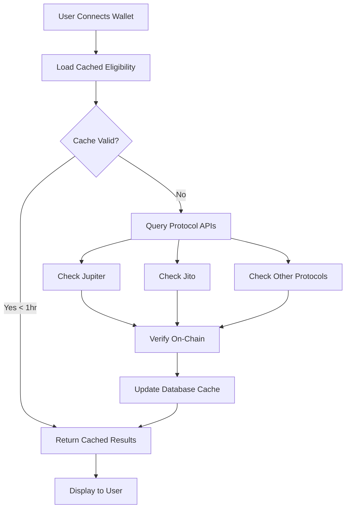
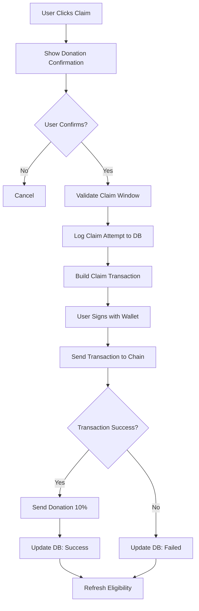

# Airdrop Checker & Claimable System Documentation

## Overview

The GXQ Studio Airdrop Checker & Claimable System is a production-ready, mainnet-compatible solution for checking airdrop eligibility and executing claims across multiple Solana protocols. The system integrates live on-chain verification, database caching, comprehensive audit logging, and a 10% developer fee mechanism.

## Architecture

### Components

1. **Backend Service** (`src/services/airdropChecker.ts`)
   - Core eligibility checking logic
   - On-chain verification using Solana Web3.js
   - Merkle proof structure support
   - Claim execution framework
   - Donation mechanism (10% to dev wallet)

2. **Database Layer** (`db/`)
   - PostgreSQL schema with 4 airdrop-specific tables
   - Eligibility caching (1-hour TTL)
   - Comprehensive audit logging
   - Time-based claim window tracking

3. **API Endpoints** (`webapp/app/api/airdrops/`)
   - `GET /api/airdrops/check` - Check eligibility for all protocols
   - `POST /api/airdrops/claim` - Execute single airdrop claim
   - `POST /api/airdrops/claim-all` - Batch claim multiple airdrops
   - `GET /api/admin/airdrops` - Admin audit log viewer

4. **Frontend UI** (`webapp/app/airdrop/page.tsx`)
   - Real-time eligibility display
   - Donation acknowledgment flow
   - Status badges (Live, Verified, Claimed)
   - Deadline tracking
   - Loading states and error handling

## Supported Protocols

- **Jupiter** (JUP) - Solana's leading DEX aggregator
- **Jito** (JTO) - MEV and liquid staking protocol
- **Pyth** (PYTH) - Oracle network
- **Kamino** (KMNO) - DeFi yield optimization
- **Marginfi** (MRGN) - Decentralized lending

### Adding New Protocols

To add a new protocol:

1. Add protocol checking method to `AirdropChecker` class:
```typescript
private async checkNewProtocolAirdrop(): Promise<AirdropInfo | null> {
  try {
    const response = await axios.get(`https://api.newprotocol.com/airdrop/${this.userPublicKey.toString()}`);
    if (response.data && response.data.amount) {
      return {
        protocol: 'NewProtocol',
        tokenMint: 'NEW_TOKEN_MINT_ADDRESS',
        amount: response.data.amount,
        claimable: true,
        claimed: false,
      };
    }
  } catch (error) {
    console.error('NewProtocol check failed:', error);
  }
  return null;
}
```

2. Add to `checkAllAirdrops()` method
3. Add claim method with protocol-specific logic
4. Update `airdrop_programs` table with protocol metadata

## Database Schema

### `airdrop_eligibility`
Caches eligibility results to reduce API calls and improve performance.

**Key Fields:**
- `wallet_address` - User's Solana wallet
- `protocol` - Protocol name (Jupiter, Jito, etc.)
- `is_eligible` - Boolean eligibility status
- `amount` - Claimable token amount
- `claimed` - Whether user has claimed
- `claim_deadline` - Claim window end time
- `merkle_proof` - JSON array of merkle proof hashes
- `checked_at` - Timestamp for cache invalidation

### `airdrop_claims`
Audit log of all claim attempts and results.

**Key Fields:**
- `wallet_address` - Claimer's wallet
- `protocol` - Protocol being claimed
- `amount` - Amount claimed
- `transaction_signature` - On-chain transaction hash
- `status` - pending | success | failed | simulated
- `donation_amount` - 10% dev fee amount
- `donation_sent` - Whether donation was sent
- `error_message` - Failure reason if applicable
- `user_ip_address` - IP for fraud detection
- `user_agent` - Browser/client information
- `initiated_at` / `completed_at` - Timing data

### `airdrop_programs`
Protocol configuration and metadata.

**Key Fields:**
- `protocol` - Unique protocol identifier
- `program_id` - Solana program address
- `token_mint` - Token mint address
- `claim_start_time` / `claim_end_time` - Claim window
- `total_allocation` - Total tokens allocated
- `eligibility_api_url` - API endpoint for checking
- `requires_merkle_proof` - Boolean flag

## API Reference

### Check Eligibility

```bash
GET /api/airdrops/check?walletAddress=<WALLET_ADDRESS>
```

**Response:**
```json
{
  "success": true,
  "walletAddress": "...",
  "airdrops": [
    {
      "protocol": "Jupiter",
      "tokenMint": "JUPyiwrYJFskUPiHa7hkeR8VUtAeFoSYbKedZNsDvCN",
      "amount": 1000,
      "claimable": true,
      "claimed": false,
      "claimDeadline": "2024-12-31T23:59:59Z",
      "onChainVerified": true,
      "hasMerkleProof": true
    }
  ],
  "claimableCount": 1,
  "totalAirdrops": 1,
  "timestamp": 1703174400000
}
```

### Claim Single Airdrop

```bash
POST /api/airdrops/claim
Content-Type: application/json

{
  "protocol": "Jupiter",
  "walletAddress": "...",
  "signedTransaction": "<BASE64_SIGNED_TX>"
}
```

### Claim All Airdrops

```bash
POST /api/airdrops/claim-all
Content-Type: application/json

{
  "walletAddress": "...",
  "signedTransactions": ["<BASE64_TX_1>", "<BASE64_TX_2>"],
  "protocols": ["Jupiter", "Jito"]
}
```

### Admin Audit Log

```bash
GET /api/admin/airdrops?status=success&limit=100
Authorization: Bearer <ADMIN_TOKEN>
```

**Response:**
```json
{
  "success": true,
  "claims": [...],
  "stats": {
    "total": 150,
    "pending": 5,
    "success": 140,
    "failed": 5
  },
  "byProtocol": {
    "Jupiter": { "count": 80, "total": 80000 },
    "Jito": { "count": 70, "total": 35000 }
  }
}
```

## Eligibility Checking Flow



## Claim Execution Flow



## Developer Fee System

All successful airdrop claims automatically send 10% of the claimed tokens to the developer wallet (`monads.solana`). This is disclosed to users before claim execution.

**Implementation:**
1. Calculate donation amount: `claimedAmount * 0.10`
2. Get or create developer's associated token account
3. Execute SPL token transfer after successful claim
4. Log donation transaction signature
5. Handle donation failures gracefully (doesn't block claim)

**Configuration:**
- Dev wallet: `process.env.DEV_FEE_WALLET` (default: `monads.solana`)
- Fee percentage: `process.env.DEV_FEE_PERCENTAGE` (default: `0.10` = 10%)

## On-Chain Verification

The system verifies eligibility on-chain by:

1. **Token Account Check**: Verifies if user already has the airdrop token (possible prior claim)
2. **Balance Verification**: Checks current token balance
3. **Program Account Validation**: Confirms airdrop program accounts exist
4. **Merkle Proof Structure**: Supports merkle tree-based distribution programs

## Security Considerations

### Production Deployment

1. **Private Key Management**
   - Never commit `.env` files
   - Use environment variables for all secrets
   - Rotate credentials regularly
   - Consider hardware wallet integration

2. **Rate Limiting**
   - Implement API rate limiting middleware
   - Use Redis for distributed rate limiting
   - Protect against claim spam

3. **Transaction Security**
   - Always simulate transactions before sending
   - Set appropriate priority fees
   - Implement slippage protection
   - Use recent blockhash validation

4. **Database Security**
   - Enable SSL/TLS for database connections
   - Use parameterized queries (防 SQL injection)
   - Regular backups
   - Restrict admin endpoint access

5. **Frontend Security**
   - Validate all user input
   - Use wallet adapter for transaction signing
   - Never expose private keys in browser
   - Implement CSRF protection

### Audit Logging

All claim attempts are logged with:
- Timestamp
- Wallet address
- Protocol
- Amount
- Transaction signature
- Status (success/failed)
- Error messages
- User IP address
- User agent string

This provides complete audit trail for:
- Fraud detection
- Compliance reporting
- Performance monitoring
- Error debugging

## Testing

### Unit Tests
```bash
npm test src/__tests__/airdropChecker.test.ts
```

### Integration Tests
```bash
# Test on Solana devnet first
SOLANA_RPC_URL=https://api.devnet.solana.com npm test
```

### Manual Testing Checklist

- [ ] Eligibility checking for all protocols
- [ ] Cache invalidation after 1 hour
- [ ] On-chain verification
- [ ] Claim window validation
- [ ] Donation confirmation dialog
- [ ] Transaction signing with wallet
- [ ] Successful claim flow
- [ ] Failed claim handling
- [ ] Batch claim execution
- [ ] Admin audit log viewing
- [ ] Loading states
- [ ] Error messages
- [ ] Mobile responsiveness

## Deployment

### Environment Variables

Required:
```bash
SOLANA_RPC_URL=https://api.mainnet-beta.solana.com
WALLET_PRIVATE_KEY=<base58_key>
DEV_FEE_WALLET=monads.solana
DEV_FEE_PERCENTAGE=0.10
```

Optional:
```bash
DB_HOST=localhost
DB_PORT=5432
DB_NAME=gxq_studio
DB_USER=postgres
DB_PASSWORD=<password>
```

### Database Setup

```bash
# Initialize database schema
psql -U postgres -d gxq_studio -f db/schema.sql

# Verify tables created
psql -U postgres -d gxq_studio -c "\dt"
```

### Build and Deploy

```bash
# Install dependencies
npm install

# Build backend
npm run build:backend

# Build webapp
npm run build:webapp

# Start production server
npm start
```

## Monitoring

### Key Metrics

- Eligibility check latency
- Claim success rate
- Donation success rate
- API error rates
- Database query performance
- Cache hit ratio

### Health Checks

```bash
# Check database connectivity
curl http://localhost:3000/api/health/db

# Check RPC connectivity
curl http://localhost:3000/api/health/rpc

# Check airdrop service status
curl http://localhost:3000/api/health/airdrops
```

## Future Enhancements

### Immediate (SDK Integration Needed)
- [ ] Implement actual Jupiter claim transactions
- [ ] Implement actual Jito claim transactions
- [ ] Implement actual Pyth claim transactions
- [ ] Implement actual Kamino claim transactions
- [ ] Implement actual Marginfi claim transactions

### Short-term
- [ ] Add transaction simulation before execution
- [ ] Implement retry logic for failed claims
- [ ] Add WebSocket for real-time status updates
- [ ] Create admin dashboard UI
- [ ] Add email notifications for successful claims
- [ ] Implement rate limiting middleware

### Long-term
- [ ] Support for additional protocols
- [ ] Multi-sig claim support
- [ ] Scheduled claims
- [ ] Price tracking for value calculations
- [ ] Tax reporting export
- [ ] Mobile app integration

## Support

For issues or questions:
- GitHub Issues: https://github.com/SMSDAO/reimagined-jupiter/issues
- Developer: monads.solana
- Documentation: This file

## License

See LICENSE file in repository root.
